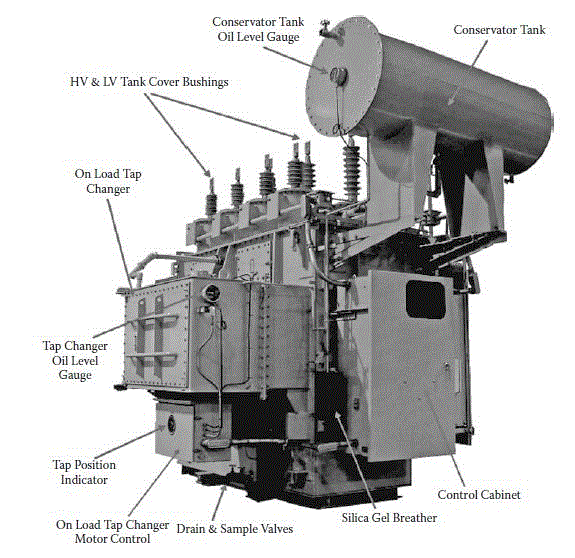
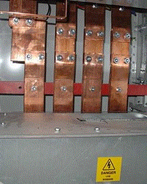
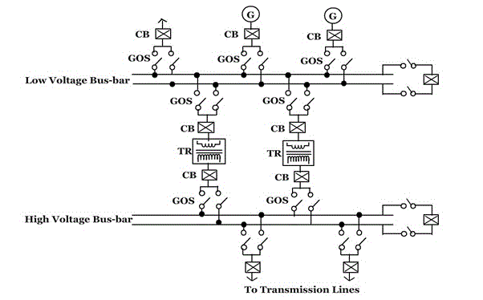

When there is a fault(short circuit current) in a transformer or bus, there will be a large amount of current flowing in the system and can cause damage to the instruments or system. So circuit breakers are used to protect the instrument or system by opening the circuit under such conditions. The working of the system is displayed in the workstation. The parameters like current or voltage or power in such system (substations) is measured using instrument transformers. Let us see power transformer, instrument transformer, circuit breaker and bus-bar in detail:

<u>**Transformers**</u>

The main advantage of alternating currents over direct currents is that, the alternative currents can be easily transferable from low voltage to high or high voltage to low. Alternating voltages can be raised or lowered as per requirements in the different stages of electrical networks as generation, transmission, distribution and utilization. This is possible with a state device called transformer. The transformer works on principle of mutual induction. It transfers an electrical energy from one circuit to other when there is no electrical connection between the two circuits. Thus we can define transformer as below:

Key point: The transformer is a static piece of apparatus by means of which an electrical power is transferred from one alternating current circuit to another with the desired change in voltage and current without any change in frequency.

As an example, see the fig below to see how transformers are used in transmission system:

Use of transformers in transmission system

Fig (a)

<u>Trivia</u>:- DC supply cannot be used for the transformers.

<u>**Principle of working**</u>  
It works on the principle of mutual induction, mutual induction states that when 2 coils are inductively coupled and if current in one coil is changed informally then an e.m.f. gets induced in the other oil. This e.m.f. can drive a current, when a closed path is provided to it. The transformer works on the same principle.

The basic transformer is shown in figure below

Basic transformer  
Fig (b)

An alternating voltage source is connected to one of the coils. This coil in which electrical energy is fed with the help of source is called primary winding (p).The other winding is connected to the load. The electrical energy which is transformed to this winding is drawn out to the load. This winding is called secondary winding(s).The primary winding has N1 number of turns while the secondary has N2 number of turns.

Symbolic representation of a transformer  
Fig (c)

The secondary voltage depends on the number of turns in primary and secondary winding. The secondary voltage will be having different voltage level but same frequency as the primary.

Fig (d)

<u>**Voltage Ratio**</u>

The ratio of secondary induced e.m.f. to primary induced e.m.f. is known as voltage transformation ratio denoted as K.

(E2/E1) = (N2/N1) = K

K=(N2/N1)

<u>**Note**</u>:-

1. If N2 > N1 i.e. :K >1  
   We get E2 > E1 then the transformer is called step up transformer.
2. If N2 < N1 i.e. :K < 1  
   We get E2 < E1 then the transformer is called step down transformer.
3. If N2 = N1 i.e. :K = 1  
   We get E2 = E1 then the transformer is called isolation or 1:1 transformer.

<u>**Ideal transformer**</u>  
Ideal transformer has following properties:

1. No losses.
2. Windings have zero resistance.
3. All the flex produced by primary links with the secondary i.e. leakage flex is zero.
4. Permeability of core is so high that negligible current is required to establish the flex in it.

<u>**Current ratio**</u>  
In an ideal transformer there are no losses. Therefore the product of primary voltage V1 and primary current I1, is same as the product of secondary voltage V2 and the secondary current I2.  
So V1 I1 = input VA and V2 I2= output VA.  
For an ideal transformer,  
V1 I1 = V2 I2

(V2/V1) = (I2/I1) = K

Therefore the current are in the inverse ratio of the voltage transformative ratio.

<u>**Taps or Tap changer**</u>  
The transformer is provided with a taps in order to adjust the voltage ratio of the transformer. These taps are provided along the winding with connections to a tap-changing device that makes the physical change in the in-service tap. The tap changing device is usually placed on the primary winding to minimize the current to be switched and can be “off-circuit “ or “on-load” type .When the primary voltage is low, the tap changer reduces correspondingly the number of primary turns to maintain the secondary voltage constant. Similarly, when the primary voltage is high, the tap changer increases correspondingly the number of primary turns to maintain the secondary voltage constant.

<u>**Off-circuit taps**</u>  
In industrial power system, off-circuit taps are used with dry-type transformer, liquid-immersed transformer, when they are not connected directly to the utility power supply. On the primary (high voltage side) of step-down transformer, four full-capacity taps (five positions) are provided in four 2.5% steps, 2 above and 2 below normal. The tap-changer mechanism should change the taps on all three phases simultaneously. Also, it should be operable form ground level, with tap changer position for padlocking. Important thing here to be noticed is that the transformer must be de-energized before the tap changer mechanism is operated.

<u>**On-load tap changer**</u>  
On-load tap changers (OLTC) are mostly with oil-immersed transformer connected to the utility power supply at a voltage level exceeding 34.5kV.Because the majority of power companies stipulated a voltage variation of ±10 % in the power contract, the tap changer is provided with an equivalent range of voltage regulation of ±10 % in 16 or 32 steps. 16 step tap changer provides 5/4% voltage change in each step.32step tap changer provides 5/8% voltage change in each step thus more preferred.

When the tap-changer design requires an oil-expansion tank, it shall be piped to a separate compartment in the conservator. A separate tap-changer gas-detector relay is located in this pipe.

The tap-changing control equipment includes:

1. Control and paralleling equipment.
2. Line drop compensation equipment along with the current transformer to provide voltage control at a point remote from the measuring point.
<ul style="list-style-type: disc">
    <li>Automatic voltage-regulating relay.</li>
    <li>Weather proof control cabinet, accessible from ground level.</li>
</ul>

<u>**Oil-filled(immersed) transformers**</u>

Oil filled transformer makes use of oil for the cooling of major parts of a transformer.

Use of transformers in transmission system

Fig (e)

Oil filled transformers are transformers filled with a highly refined mineral oil that is used to insulate internal live parts of the transformer. The oil prevents corona and manages temperature control inside the transformer for the prevention of equipment and machinery overheating during the operation of large job applications. Because of oil inside the transformer being of non-combustible properties, these transformers are very safe and can operate machinery for long period of time.

<u>Oil or liquid preservation system for oil-filled transformer</u>

A preservation system is essential for a liquid-immersed transformer to allow- expansion and contraction of the liquid due to the changes in the temperature with-out exposing the insulating liquid to external contamination. The expansion space is known as “the oil preservation system”. There are four different designs:

<ul style="list-style-type: disc">
<li>Sealed tank</li>
<li>Gas-oil seal</li>
<li>Conservator</li>
<li>Conservator diaphragm</li>
</ul>

Let us see conservator design in detail:  
The conservator is an oil-expansion tank mounted above the highest oil point on the transformer. The transformer tank and conservator are connected through a pipe, and a gas-detector relay (buchholz relay ) is installed in the pipe. The transformer oil expands and contracts with the increase and decrease of the oil temperature. The conservator must therefore breathe to the surrounding air, and moisture in the air can be absorbed into the oil and insulation system. To prevent the moisture from entering the conservator, a silica gel breather is provided that will dry the air as the breathing takes place. As the silica gel absorbs the moisture, it will change from blue to pink in colour and must be changed to retain its drying capability. So maintenance is required.

The accessories for mineral-oil transformer generally consists of:

<ul style="list-style-type: disc">
  <li>A conservator tank.
<li>Buchholz relay ( gas-detector relay ) for conservator-type transformer. Buchholz relay is located in the pipe between the highest part of the transformer tank and conservator. The relay consists of two sets of contacts, one contact for trip upon surge and other alarm upon gas accumulation.</li>
<li>Breather of dehydrating type for conservator-type transformers containing a colour indicator( usually silica gel), piped to the conservator and mounted in such a way that it is accessible from ground level.</li>
<li>Winding temperature-indicator.</li>
<li>Oil temperature indicator.</li>
<li>Cooling equipment like radiators, fans for forced air cooling, and pumps for forced oil – and water- cooled transformer.</li>
</ul>

<u>**Instrument transformers**</u>

It is not practicable to connect instruments and meters directly to the lines in high voltage circuits, so instrument transformers are used. The two basic advantages of this method are:

<ul style="list-style-type: disc">
<li>Standard rated instruments may be used easily.</li>
<li>Operating personnel coming in contact with the instruments are not subjected to high voltage and currents of the lines, and so there is less danger to them. Even with a low-voltage system, instrument transformers are used for measuring large currents, so that heavy leads to the instrument panel and to the ammeter and other current terminals are avoided.</li>
</ul>

The instrument transformers are classified as
follows:

1. Potential transformers
2. Current transformers

<u>**Potential transformers(P.T.)**</u>:

A potential transformer is a step down transformer used along with a low range voltmeter for measuring a high voltage. The primary is connected across the high voltage supply and the secondary to the voltmeter or potential coil of the wattmeter. Since the voltmeter (or potential coil) impedance is very high, the secondary current is very small and the potential transformer behaves as an ordinary two winding transformer operating on no load.

Fig (f)

The above fig shows a potential transformer used to measure the voltage of a circuit. It may be noted that the secondary is grounded. This is done so that if the insulation breaks down, the high voltage does not endanger personnel who may be reading the meters.  
These transformers are made with <i>high quantity iron core operating at very low flux densities so that the magnetising current may be very small. </i>Careful designs ensure minimum variation of voltage ratio with load and minimum phase shift between input and output voltages. Potential transformers secondary are commonly designed for an output of 110V.

<u>**Current transformers**</u>:  
The range of the D.C. ammeter is extended using a shunt, similarly a current transformer performs the same function in A.C. circuits. Thus a high magnitude A.C. can be measured by a combination of current transformer and a low range ammeter.  
In current transformer, the primary side consists of a very few turns of thick cross-section connected in series with the high current lines. Mostly, the primary is just one turn formed by taking the line conductor through the secondary winding (fig (g)).

Fig (g)
Line conductor acting as primary

The secondary winding consists of large number of turns of fine wire designed for either 5A or 1A rating. Thus a current transformer is a step up transformer. The current transformer has the secondary effectively short-circuited through the low impedance of the ammeter. The fig (h) below shows the current transformer connections.

Fig (h)

The current transformer ratio is not equal to the ratio of secondary to primary turns, mainly because of the effect of magnetizing current.  
A current transformer must never be operated on open circuit for the following reasons:

<ul style="list-style-type: disc">
<li>There will be no secondary m.m.f. and since the primary current(and m.m.f.) is fixed, the core flux will increase enormously. This will cause large amount of eddy current and hysteresis losses and the resulting high temperature may damage the insulation or even the core.</li>
<li>As the secondary side is open , a very high voltage will be induced in the multi-turn secondary and this high voltage is dangerous to both life and to the insulation.</li>
</ul>

Fig (i)

The above diagram shows the wiring diagram for potential and current instrument transformers.

<u>**Circuit breakers**</u>

A circuit breaker is an automatically operated electrical switch designed for to protect an electrical circuit from damage caused by overload or short circuit. Or, in other words, the function of a circuit breaker is to isolate the faulty part of the power system in case of abnormal conditions. A protective relay detects abnormal conditions and sends a tripping signal to the circuit breaker. After receiving the trip command signal from the relay the circuit breaker isolates the faulty part of the power system

fig(j)  
Separation of the contacts of the circuit breaker

A circuit breaker has two contacts- a fixed contact and a moving contact. Under normal conditions these two contacts remain in closed position. When the circuit breaker is required to isolate the faulty part, the moving contact moves to interrupt the circuit. On the separation of the contacts, the flow of current is interrupted, resulting in the formation of an arc between the contacts. These contacts are placed in a closed chamber containing some insulating medium (like gas or liquid) which extinguish the arc.

Insulating fluid is used for arc extension and the fluid chosen depends upon the rating and type of circuit breaker.  
The insulating fluids commonly used for circuit breaker are:

1. Air at atmospheric pressure
2. Compressed air
3. Ultra high vacuum
4. Oil which produces hydrogen for arc extension
5. Sulphur hexafluoride (SF6 )

Some of the gases which have been used in circuit breaker are:

<ul style="list-style-type: disc">
<li>Electromagnetic gases : Sulphur hexafluoride , arcton</li>
<li>Simple gases: Air, oxygen, hydrogen, nitrogen and carbon dioxide.</li>
</ul>

The important characteristics of the fluids used in circuit breaker are:

1. It should have good thermal and chemical stability.
2. It should have high declarative strength.
3. Non-inflammability and high thermal conductivity.
4. Arc extinguish ability.

<u>**Classification of circuit breakers**</u>

1. High voltage circuit breakers
2. Low voltage circuit breakers

<u>**High voltage circuit breakers**</u>

1. <u>Oil circuit breakers</u>:-  
   i. Bulk oil circuit breakers using a large quantity of oil.  
   ii. Low oil circuit breakers which operate with a minimum amount of oil.

2. <u>Oil less circuit breakers</u>:-  
   i. Hard gas circuit breakers  
   ii. Air blast circuit breakers  
   iii. Sulphur hexafluoride circuit breaker  
   iv. Water circuit breakers  
   v. Vacuum circuit breakers

<u>**Characteristics of high voltage rating circuit breaker**</u>:-

1. High voltage rating circuit breaker should have high reliability electrically and mechanically.
2. High voltage rating circuit breaker should be capable of interrupting capacitive and inductive circuits and fault currents of all values within their rating.

Let us see some of the features of major circuit breakers:

(1) <u>OIL CIRCUIT BREAKERS (O.C.B)</u>:
Oil circuit breakers are the most common and oldest type of circuit breakers. The rating range of circuit breakers lies in range of 25MVA at 2.5kV and 5000MVA at 250kV. In oil circuit breaker, the separating contacts are made to separate within insulating oil medium, which has better insulating properties than air.

<u>Few advantages of using oil as an Arc quenching medium</u>:-

1. Dielectric strength is high
2. As a result of decomposition of oil, it has good cooling property
3. It acts as an insulator between live part and earth
4. Surrounding oil in close proximity to the arc presents a large cooling surface

<u>Few disadvantages</u>:-

1. Highly inflammable and can cause an explosion by mixing with air
2. It requires maintenance
3. Periodic replacement

(2) <u>AIR BLAST CIRCUIT BREAKERS</u>:-  
Air blast circuit breakers is a type of circuit breaker which use a high pressure air blast (at a pressure of 20bar) as an arc quenching medium. Ranges 132kV and above up to 400kV ,with the braking capacity up to 7500MVA .But can also be designed to cover the wide range of 66kV to 132kV.

<u>Few advantages</u>:-

1. No risk of explosion and fire hazards
2. Consistent and short arc duration
3. Since the arc duration is short and consistent, the burning of the contact is less due to less arc energy
4. High speed enclosures facility
5. Comparatively less maintenance required

<u>Few disadvantages</u>:-

1. Current chopping
2. Sensitivity to restricting voltage

(3) <u>SULPHUR HEXAFLUORIDE(SF6)CIRCUIT BREAKER</u>:-
Sulphur hexafluoride to other medium such as oil or air for the use in circuit breakers for the following reasons:

1. Being an Inert gas, it is non-reactive to the other components of circuit breakers
2. Sulphur hexafluoride has high dielectric strength (about 24 times that of air and it is comparable to that of oil)
3. When extinction of arc is concerned it is about 100 times more effective than air
4. Its heat transfer property is about 16times that of air because of its high density

<u>Applications</u>:-

1. The circuit breakers are designed for voltages 115kV to 230kV, power rating of 10MVA to 20MVA and interrupting times less than 3cycles.
2. A typical sulphur hexafluoride circuit breaker consist of interrupter units, each capable of dealing with currents up to 60000A and voltage in the range of 50 to 80kV.A number of units are connected in series according to the voltage of the system.

<u>Few Advantages</u>:-

1. No risk of fire
2. No reduction of dielectric strength
3. Arcing time is very short; this reduces the erosion of contact
4. Its operation is very silent
5. The current chopping tendency is minimized by using sulphur hexafluoride gas at low pressure and low velocity
6. The breaker is compact in size and totally enclosed. Thus electrical clearances are drastically reduced and are particularly suitable where explosion hazard exists, like coal mines

<u>Disadvantages</u>:-

1. Expensive
2. Sulphur hexafluoride gas has to be reconditioned after every operation of the breaker and additional equipment is required for this purpose

(4) <u>VACUUM CIRCUIT BREAKERS(V.C.B)</u>:-
Vacuum means the pressure below atmospheric pressure which is 760 mm of Hg. In a vacuum circuit breaker, vacuum of the order of 10-5 to 10-7 (1 torr = 1 mm of Hg) is used as the arc quenching medium. The dielectric strength of the vacuum is 1000 times more than that of any other medium.

<u>Applications</u>:-

1. Vacuum breakers are being used for outdoor applications ranging from 22kV to 66kV. They are also suitable for majority of applications in several areas even with limited rating say 60 to 100MVA.
2. Vacuum circuit breakers are used for capacitor-bank switching, transformer, reacting switching, where the voltages are high and current to be interrupted is low.

<u>Few important terms regarding circuit breakers</u>:-

1. <u>Arc voltage</u>:-  
   The voltage across the contacts during the arcing period is known as the "arc voltage"

2. <u>Restriking voltage</u>:-  
   The transient voltage appearing across the contacts during arc period is called the “restriking voltage”.

3. <u>Recovery voltage</u>:-  
   It is normal frequency (50Hz) r.m.s. voltage that appears across the contact of the circuit breaker after the final extinction. It is approximately equal to the system voltage.

4. <u>Rate of Rise of restriking voltage(RRRV)</u>:-  
   The average RRRV = Peak value of restriking voltage/Time taken to reach the peak value

5. <u>Current Chopping</u>:-  
   When low inductive current (e.g. current to a shunt reactor or magnetising current of a transformer) is interrupted by a circuit breaker and the arc quenching force of the circuit breaker is more than necessary to interrupt a low magnitude of current, the current will be interrupted before its manual zero instant. It is termed as current chopping.

<u>**Rating of circuit breakers**</u>:-  
A circuit breaker is expected to perform the following duties (besides normal working) under short circuit/fault conditions:

1. To open the contacts to clear the fault and isolating the faulty section.
2. To close the contacts on to a fault.
3. It must be able to carry fault current for a short time while another circuit breaker (in series) is clearing the fault.

Therefore, in addition to the rated voltage, current and frequency, circuit breakers have the following important ratings.

1. Breaking capacity
2. Making capacity
3. Short-time capacity

1.<u>Breaking capacity</u>:-  
It is the current (r.m.s. value) that a circuit breaker is capable of breaking under specified conditions (e.g. PPPV, power factor) and given recovery voltage.

Where V=Rated service lines in volts,  
I =rated breaking current (symmetrical or asymmetrical) in ampere.

2.<u>Making capacity</u>:-  
The peak value of current (including the DC component) during first cycle of current wave after the closure of circuit breaker is known as “making capacity”.
Making capacity = 2.55 × symmetrical breaking capacity

3.<u>Short-time capacity</u>:-  
The short time rating of a circuit breaker depends upon its ability to withstand the temperature rise and the electromagnetic force effects. The oil circuit breakers have a specified limit of 3 seconds when the ratio of symmetrical breaking current to the rated normal current does not exceed 40. However if this ratio exceeds 40, then the specified limit is 1second.

<u>Normal current rating</u>:- It is the r.m.s value of current which the circuit breaker is capable of carrying continuously at its rated frequency under specified conditions.

<u>**Bus-bar**</u>  
In electrical power distribution, a bus bar is a strip of copper or <i>aluminium</i> that conducts electricity within a switchboard, distribution board, substation or other electrical apparatus.

The size of the bus bar determines the maximum amount of current that can be safely carried. Bus bars can have a cross-sectional area of as little as 10 mm2 but electrical substations may use metal tubes of 50 mm in diameter (1,963 mm2) or more as bus bars.

Bus bars are typically either flat strips or hollow tubes as these shapes allow heat to dissipate more efficiently due to their high surface area to cross-sectional area ratio. The skin effect makes 50–60 Hz AC bus bars more than about 8 mm (1/3 in) thick inefficient, so hollow or flat shapes are prevalent in higher current applications.

<u>**Note**</u>: <i>Skin effect is the tendency of an alternating electric current (AC) to distribute itself within a conductor with the current density being largest near the surface of the conductor, decreasing at greater depths.</i>

Fig (k)  
1500 ampere bus bars within a power distribution rack for a large building

A bus bar may either be supported on insulators, or else insulation may completely surround it. Bus bars are protected from accidental contact either by a metal earthed enclosure or by elevation out of normal reach. Neutral bus bars may also be insulated. Earth bus bars are typically bolted directly onto any metal chassis of their enclosure. Busbars may be enclosed in a metal housing, in the form of bus duct or busway, segregated-phase bus, or isolated-phase bus.  
Bus bars may be connected to each other and to electrical apparatus by bolted, clamp, or welded connections. Often joints between high-current bus sections have matching surfaces that are silver-plated to reduce the contact resistance.

Fig (l)  
Solid isolated busbar system

When several feeders or generators operating at the same voltage have to be directly connected electrically, bus-bars are used as the common electrical equipment. The bus-bars provide adequate operating flexibility, cost reduction and sufficient reliability.

Bus-bar arrangements:

<ul style="list-style-type: disc">
<li>Single bus-bar system.</li>
<li>Double bus-bar system with sectionalisation.</li>
</ul>

<u>Single bus-bar system</u>:  
In case of a power plant which has number of generators and single bus-bar arrangement, the bus-bar is sectionalised by circuit breakers. The major advantage of this type of system is that fault on one part of the bus-bar or system does not completely shut down the whole station.

Fig (m)  
Single bus-bar system

G=generator, GOS= group operated switches, CB=circuit breaker, TR=step up transformer.

<u>Double bus-bar system</u>:  
In this system both low voltage and voltage bus-bars are duplicated, any of the bus-bar sections can be used as desired. There is a provision of a bus-bar coupling switch for transferring operation from one bus-bar to another.

Fig (n)  
Double bus-bar system

<u>**Note**</u>: Bus coupler is a device which is used switch from one bus to the other without any interruption in power supply and without creating hazardous arcs. It is achieved with the help of circuit breaker and isolators.

